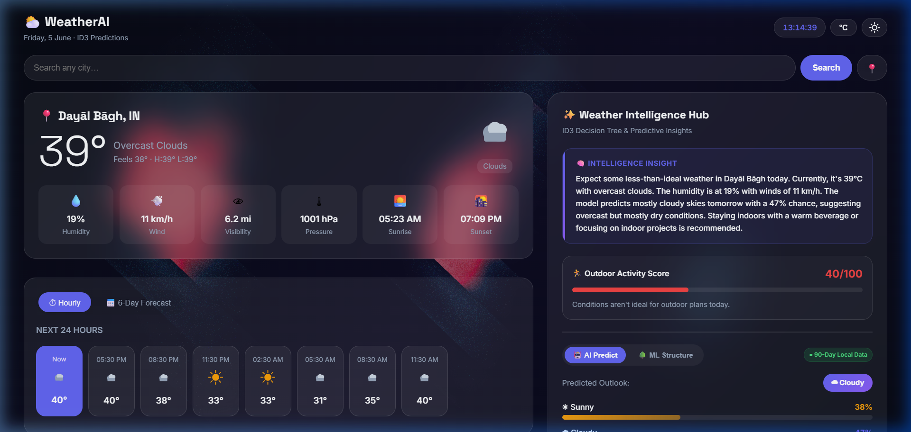

# 🌦️ WeatherAI-ID3-Predictor

A state-of-the-art Weather Dashboard combining **real-time weather diagnostics**, **client-side predictive Machine Learning (ID3 Decision Tree)**, and **GPU-accelerated interactive WebGL graphics** wrapped in a modern glassmorphic interface.

---

## 📸 Project Screenshot



---

## ✨ Core Features

*   **Premium Glassmorphic UI**: High-end visual aesthetics using frosted-glass containers, adaptive background overlays, and fluid animations.
*   **WebGL Interactive Canvas**: A responsive, GPU-accelerated animated background powered by **Unicorn Studio** that dynamically reacts to browser resizing and theme shifts.
*   **Local Machine Learning (ID3 Classifier)**: Calculates real-time forecasting probabilities locally in the browser using the ID3 (Iterative Dichotomiser 3) algorithm:
    *   *Dynamic Climatology Training*: Fetches 90 days of historical weather data from Open-Meteo based on your location coordinates to train the classifier dynamically.
    *   *Fallback Engine*: Automatically boots a local training dataset parsed from a CSV file in cases of connection dropouts.
*   **Adaptive Dual Themes**: Easily toggle between dark and light modes, adjusting text contrast and transparency to highlight underlying background shaders.
*   **Geo-Location Mapping**: Auto-detects GPS coordinates using the HTML Geolocation API to fetch city details and initialize localized ML models.
*   **Claude AI Weather Assistant**: Integration support for Anthropic Claude 3.5 Sonnet to provide friendly, natural-language weather advice and practical outdoor tips.
*   **Outdoor Activity Index**: Displays a computed score (0-100) detailing whether conditions are favorable for outdoor tasks based on temperature, pressure, wind, and humidity.

---

## 🛠️ Architecture & Technologies

*   **Frontend Library**: [React 18.2](https://react.dev/)
*   **Build Tool**: [Vite](https://vitejs.dev/) (utilizing Native ESM and fast Esbuild triggers)
*   **3D/Canvas Graphics**: [Unicorn Studio](https://unicorn.studio/) WebGL wrapper
*   **APIs Integrated**:
    *   *OpenWeatherMap*: Current weather details and 5-day forecasts.
    *   *Open-Meteo*: 90-day climatological data queries.
    *   *Anthropic API*: LLM-driven weather insights (requires `VITE_ANTHROPIC_API_KEY` in environment).
*   **Configuration**: 
    *   [tsconfig.json](tsconfig.json): Tailored loose-mode configuration supporting `.tsx` rendering and resolving path mappings in VS Code without strict checking.
    *   [vite.config.js](vite.config.js): Handles resolving `@/` path alias pointing to the root workspace and deduplicates React imports.

---

## 📂 Project Structure

```
├── components/
│   ├── ui/
│   │   ├── raycast-animated-background.tsx  # Canvas background container
│   │   └── demo.tsx                         # Canvas background play demo page
│   ├── AIInsight.jsx                        # Claude text bubble container
│   ├── Forecast.jsx                         # Multi-day forecast panels
│   ├── Header.jsx                           # Application Header / theme switches
│   ├── Icons.jsx                            # Condition SVG icons
│   ├── IntelligencePanel.jsx                # ID3 probability & AI hub
│   ├── OutdoorScoreCard.jsx                 # Rating indicator progress widget
│   ├── PredictionCard.jsx                   # Condition predictor indicators
│   ├── Search.jsx                           # Input field and GPS button
│   ├── TreeVisualization.jsx                # Recursive decision tree visualizer
│   └── WeatherCard.jsx                      # Main meteorological cards
├── lib/
│   └── utils.js                             # cn class-name utility
├── ml/
│   ├── dataset.js                           # Fallback learning datasets
│   ├── id3.js                               # Local ID3 Decision Tree engine
│   └── prediction.js                        # Inference and probability solver
├── public/
│   ├── historical_weather.csv               # CSV file containing training rows
│   └── screenshot.png                       # Project dashboard screenshot
├── services/
│   ├── openMeteo.js                         # Coordinates history crawler
│   └── openWeatherMap.js                    # Core weather details scraper
├── utils/
│   ├── dateUtils.js                         # Date converter utilities
│   └── weatherUtils.js                      # Categorizer and outdoor score compiler
├── index.css                                # Global styles and keyframes
├── index.html                               # Root HTML template
├── main.jsx                                 # Mount bootstrap file
├── tsconfig.json                            # TypeScript configurations
├── vite.config.js                           # Bundler resolver settings
└── WeatherDashboard.jsx                     # Dashboard main controller
```

---

## 🚀 Getting Started

### Prerequisites
Make sure you have [Node.js](https://nodejs.org/) (v18 or higher) and npm installed.

### Installation

1.  **Clone the repository**:
    ```bash
    git clone https://github.com/DivyanshGahlaut/WeatherAI-ID3-Predictor.git
    cd WeatherAI-ID3-Predictor
    ```

2.  **Install the dependencies**:
    ```bash
    npm install
    ```

3.  **Start the local development server**:
    ```bash
    npm run dev
    ```
    Open `http://localhost:5173/` in your browser.

4.  **Optional: Add Claude AI Support**:
    Create a `.env` file in the root directory and add your Anthropic API Key:
    ```env
    VITE_ANTHROPIC_API_KEY=your_anthropic_api_key_here
    ```

---

## 🌳 The Decision Tree (ID3) ML Logic

The dashboard implements Iterative Dichotomiser 3 (ID3) local training to predict the condition outlook:
*   **Entropy ($H$)** evaluates class impurity:
    $$H(S) = - \sum_{i} p_i \log_2 p_i$$
*   **Information Gain ($IG$)** measures classification efficiency before splitting:
    $$IG(S, A) = H(S) - \sum_{v} \frac{|S_v|}{|S|} H(S_v)$$
The model partitions branches based on features maximizing Information Gain, outputting exact probability ratios on the AI Predict panel.